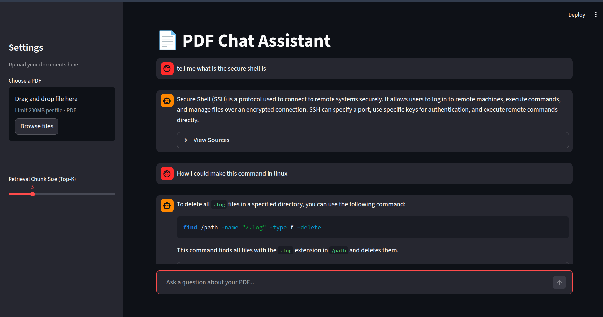

# 📄 RAG-PDF-Assistant



**RAG-PDF-Assistant** is a robust, event-driven Retrieval-Augmented Generation (RAG) system designed to bridge the gap between static documents and dynamic AI interaction. Built with a focus on reliability and scalability, this application orchestrates complex ingestion and query pipelines using **Inngest**, ensuring resilient document processing and seamless user experiences.

## 🚀 Key Features

- **⚡ Event-Driven Architecture**: Powered by **Inngest**, decoupling ingestion and query processes for high reliability and retries.
- **🔍 Advanced Vector Search**: Utilizes **Qdrant** for high-performance vector similarity search.
- **🤖 State-of-the-Art LLMs**: Integrates **OpenAI's GPT-4o-mini** and **text-embedding-3-large** for accurate context retrieval and natural language answers.
- **🧠 Intelligent Chunking**: Implements **LlamaIndex** strategies for optimal text segmentation and context preservation.
- **💬 Modern Interactive UI**: Features a sleek, dark-mode **Streamlit** chat interface with real-time feedback and source citation.

## 🛠️ Tech Stack

- **Orchestration**: [Inngest](https://www.inngest.com/) (Serverless Queues & Workflows)
- **Backend Framework**: [FastAPI](https://fastapi.tiangolo.com/) (Python)
- **Vector Database**: [Qdrant](https://qdrant.tech/)
- **Frontend**: [Streamlit](https://streamlit.io/)
- **AI/ML**: OpenAI API (Embeddings & Completion), LlamaIndex (Data Loading)
- **Dependency Management**: `uv` / `pip`

## 🏗️ Architecture

The system operates on two main workflows:

1.  **Ingestion Pipeline**:
    - **Trigger**: User uploads a PDF via Streamlit.
    - **Process**: Inngest captures the event -> PDF is parsed & chunked -> Embeddings are generated -> Vectors are upserted to Qdrant.
2.  **Query Pipeline**:
    - **Trigger**: User asks a question in the chat.
    - **Process**: Question embedding -> Semantic search in Qdrant -> Context retrieval -> LLM Answer generation with source citation.

## 📦 Installation & Setup

PRO TIP: Ensure you have valid API keys for OpenAI.

### 1. Clone the Repository

```bash
git clone https://github.com/your-username/RAG-PDF-Assistant.git
cd RAG-PDF-Assistant
```

### 2. Environment Setup

Create a `.env` file in the root directory and add your keys:

```env
OPENAI_API_KEY=sk-proj-...
INNGEST_API_BASE=http://127.0.0.1:8288/v1
```

### 3. Install Dependencies

Using `uv` (recommended) or pip:

```bash
uv sync
# OR
pip install -r requirements.txt
```

### 4. Start the Application

You need to run three components simultaneously (recommend using separate terminal tabs):

**Terminal 1: Inngest Dev Server**

```bash
npx inngest-cli@latest dev
```

**Terminal 2: FastAPI Backend**

```bash
uv run uvicorn main:app --reload
```

_Note: Ensure your Qdrant instance is running (default: http://localhost:6333)_

**Terminal 3: Streamlit Frontend**

```bash
uv run streamlit run steamlit_app.py
```

## 🤝 Contribution

Contributions are welcome! Please feel free to submit a Pull Request.
